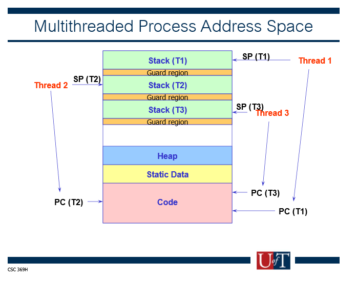
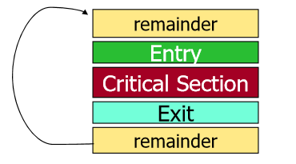
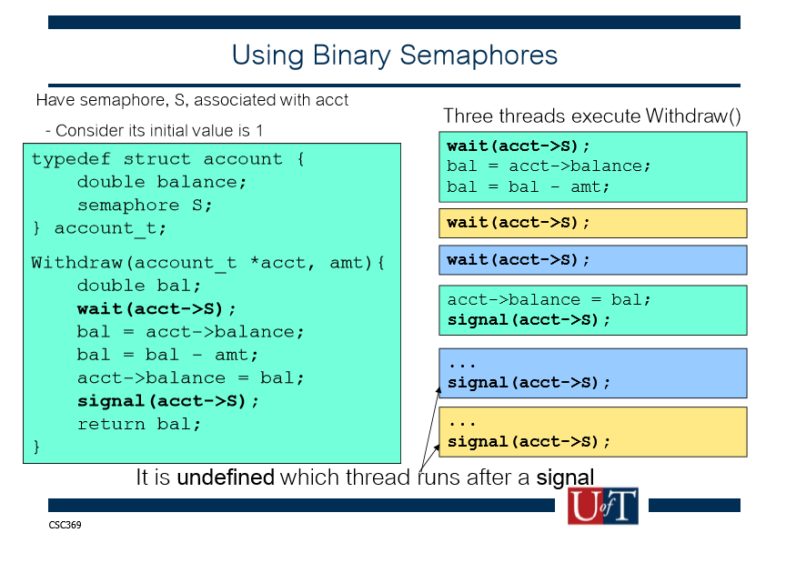

# Goal of the OS
1. Primary: convenience for the user
2. Secondary: efficient operation of the computer system.  

## Roles of the OS
* An OS is a **virtual machine**
* An OS is a **resource allocator**
* An OS is a **control program**
    * Controls the execution of user programs to prevent errors and improper use of the computer.

## Storage Hierarchy
* caches can be installed to hide performance differences when there is a large access-time gap between two levels.


## Major OS "Themes"
* Virtualization
    * Present illusion of multiple (or unlimited) resources where only one (or a few) really exist.
* Concurrency
* Persistence

## How to virtualize?
Virtualization helps with first goal (Convenience for the user)
### OS Solution - Limited Direct execution
* Key Abstraction: the process
    * Includes everything OS needs to know to manage running programs.
* Main Idea - Direct execution
    * Set up CPU so that next instruction is fetched from code of process that should be executed.
    * No overhead during process execution.
* "Limited" part
    * Need to restrict operations process can perform
    * Need to regain control.

## Hardware Support for OSs
* Protection domains -> mode bit
* Interrupts
* Timers
* Memory Management unit
* Other

### Protection Domains
* Dual-mode operation: user mode an system mode.

### Interrupts
* A hardware signal that causes the CPU to jump to a predefined instruction called the **interrupt handler.**
    >1. OS fills in interrupt Table (at boot time)
    >2. CPU execution loop:  
    >    Fetch instruction at PC, Decode instruction, execute instruction.
    >3. Interrupts occurs
    >4. CPU changes mode, disables interrupts
    >5. Interrupted PC value is saved
    >6. IDTR + Interrupt number is used to set PC to start of interrupt handler
    >7. Execution continues
* Interrupt **mechanism** supports OS goal of **efficient virtualization** in two ways:
    >1. Any illegal instruction executed by a process causes a software generated >interrupt
    >    * OS gets control
    >2. Periodic hardware-generated timer interrupt ensures OS gets control backs at >regular intervals

## Bootstrapping
* Hardware stores small program in non-volatile memory
    * BIOS - Basic Input Output system
    * Knows how to access simple hardware devices
* When power is first supplied, this program starts executing.

## Operating System Startup
* Hardware starts in system mode, OS code execute immediately.
* OS initialization:
    * initialize internal data structures
    * create first process
    * wait for something to happen
        * "something" always starts with an interrupt.
        * OS is entirely driven by external events (External to the OS, that is, not entire computer)

## What is a process
* OS abstraction for execution
    * AKA a job or a task or a sequential process
* Definition: it's a program in execution
* Programs are static entitles with the potential for execution.

## Program Layout in Memory

* A **process** contains all of the state for a program in execution
    * An address space
    * The program counter
    * A set of general-purpose registers with current values
    * A set of operating system resources
    * Context for kernel execution
* A process is named using its process ID (**PID**)
* OS data about the process is stored in a **process control block (PCB)**

### Process Control Block
* Generally includes
    * processes state (ready, running, blocked...)
    * program counter: address of the next instruction
    * CPU registers: must be saved at an interrupt
    * CPU scheduling information: process priority
    * memory management info: resource use info
    * I/O status information: list of open files

## State Queues
How does the OS keep track of processes?
* The OS maintains a collection of queues that represents the state of all processes in the file system
* Usually one queue for each state.

## Process state & state changes

1. Create new process
    * create new PCB, user address space structures
    * Allocate memory
2. Load executable
    * initialize starts state for process
    * Change state to "ready"
3. Dispatch process
    * Change state to "running"

### State Change: Ready to running
* **context switch** == switch the CPU to another process by:
    * saving the state of the old process
    * loading the saved state for the new process
* When can this happen
    * Process calls _yield()_
    * Process makes other system call and is blocked
    * Timer interrupt handler decides to switch processes

### Process Destruction
* exit()
* Process voluntarily releases all resources
* But can't discard everything immediately
    * Must stop running the process to free everything
    * Requires context switch to another process
    * Parent may be waiting or asking for the return values
* exit() doesn't causes all data to be freed
    * Zombies

## Inter-Process Communication (IPC)
* processes are isolated from each other
* Passing arguments to a newly exec'd program
    * Part of execv()
* Returning an integer exit status from child to parent
    * waitpid() & exit()
* Sending signals
    * kill()
* Shared file system
* Message passing, shared memory, synchronization primitives ...

# System Calls
## What is a System Call?
* **system call** == a function call that invokes the operating system
## Boundary Crossings
* Getting to kernel mode
    * Explicit system call - request for service by application
    * Hardware interrupt
    * Software trap or exception
* Kernel to user
    * When the OS finished its task, get back to application.

When an interrupt occurs, the reason is stored in a register which is used
to invoke a **handler**, which is a function.

In a system call operation
* Kernel must verify arguments that it is passed
* A fixed number of arguments passed in registers
* Result of system call is returned in register EAX.

## System calls dispatch
* A system call is identified by a unique number (**system call number**) passed into register %eax.
* Offers an index into an array of function pointers: the _system call table_
1. Kernel assigns each system call type a **system call number**
2. Kernel initializes **system call table**
3. User process set up system call number and arguments
4. User process runs _int N_ (on Linux, N = 80h)
5. Hardware switches to kernel mode and invokes kernel's interrupt handler for X (**interrupt dispatch**)
6. Kernel looks up system call table using system call number
7. Kernel invokes the corresponding function
8. Kernel returns by running **iret** (interrupt return)

## Passing system call parameters
* The first parameters is always the syscall number (in EAX)
* Can pass up to 6 parameters (ebx, ecx, edx, esi, edi, ebp)
* If more than 6 parameters, package the rest in a struct and pass a pointer to it as the 6th parameters
* Must validate user pointers : Use safe functions to access user pointers

# Threads
## Process Cooperation
* A process is **independent** -> No data sharing
* A process is cooperating if not independent

## Parallel Programs
### Key Idea
* Separate the address space from the execution state
* Multiple threads of execution can execute in a single address space

### Benefit of Threads
* Threads can easily share resources
* Threads are lighter weight
* Concurrent programming performance

## What is a Thread?
* A thread is a single **control flow through a program**


## Kernel Thread Limitations
* Kernel-level threads make concurrency much cheaper than processes
* May suffer from too much overhead. (Requires system calls)

## User-level Threads
* Kernel-level threads are managed by the OS
* User-level threads are managed by the run-time system.
* Small and fast

## U/L Thread Limitations
* User-level threads are invisible to the OS
* As a result, OS can make poor decisions.

## Hybrid Kernel and User Threads
## POSIX threads
* Standardized C language threads programming API (pthreads)

# Synchronization
## Two Main Uses:
1. Enforce single use of a shared resource
    * Called the **critical section problem**
2. Control order of thread execution

* Race Condition
    * Two concurrent threads manipulated a **shared resource** without any Synchronization. Outcome depends on the order in which accesses take place.

* Mutual Exclusion
    * Only one thread at a time can execute in the critical section.
    * All other threads are forced to wait on entry.
    * When a thread leaves the CS, another can enter.
    

* Critical Section Requirements
1. Mutual Exclusion
2. Progress
    * Only threads not in the "remainder" section can influence the choice of which thread enters next.
3. Bounded waiting (no starvation)

* The overhead of entering and exiting the CS is small with respect to work being done with it.

* Atomic
    * If two such instructions are executed concurrently, the result is equivalent to the sequential execution in some unknown order.

**In the example below mutual exclusion is not guaranteed**
```C
My_work(id_t id) { /* id can be 0 or 1 */
    ...
    while (flag[1-id]); /* entry section */
    flag[id] = true; /* indicate entering CS */
    /* critical section, access protected resource */
    flag[id] = false;
    ...
}
```
Each thread executes while statement, finds flag set to false.
Each thread sets own flag to true and enters CS.

## Dekker's Algorithm and Peterson's Algorithm
* Basic idea:
    * Set own flag and set turn to self
    * Spin waiting while turn is self AND other has flag set
    * If both threads try to enter their CS at the same time, turn will be set to both 0 and 1 at roughly the same time. Only one of these assignments will last. The final value of turn decides which of the two threads is allowed to enter CS first.

```C
int turn;
int flags[2];

My_work(id_t id) {
    ...
    flag[id] = true;
    turn = id;
    while (turn == id && flag[1-id]);
    /* critical section */
    flag[id] = false;
    ...
}

```

## Bakery Algorithm

## Semaphores
Abstract data types that provides synchronization
* An integer counter variable, accessed through only 2 atomic operations
* The atomic operation **wait** (aka **P** or **decrement**) decrement the variable and block until semaphore is free.
* **signal** (aka **V** or **increment**) increment the variable, unblock waiting thread if there are any.
* A queue of waiting threads.

### Type of Semaphores
* Mutex (Binary) semaphore
* Counting semaphore


### Locks vs. Semaphores
* Can use just like a lock.
* A lock has a "owner" and can only be released by its owner.

## A Lock Implementation
'''C
boolean lock;
void acquire(boolean *lock) {
    while (test_and_set(lock));
}

void release(boolean *lock) {
    *lock = false;
}
'''
This is a **spinlock**  
    Uses **busy waiting**

### Swap (or Exchange) instruction
略

## Considerations
* Spinlocks are built on machine instructions
* Machine instructions have three problems:
    * Busy waiting
    * starvation is possible
    * Deadlock is possible (**priority inversion**)

## Sleep locks
略
